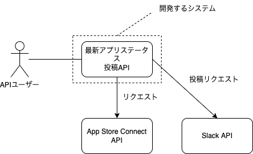

# iOSAppStatusChecker

API that checks the review submission status of iOS apps on App Store Connect and posts it to Slack.（App Store Connect 上での iOS アプリのレビュー提出ステータスをチェックし、Slack に投稿する API）

## システム概念図

## ユースケース図

## オブジェクト図

## ドメインモデル図

- 吹き出し：ビジネスルール

